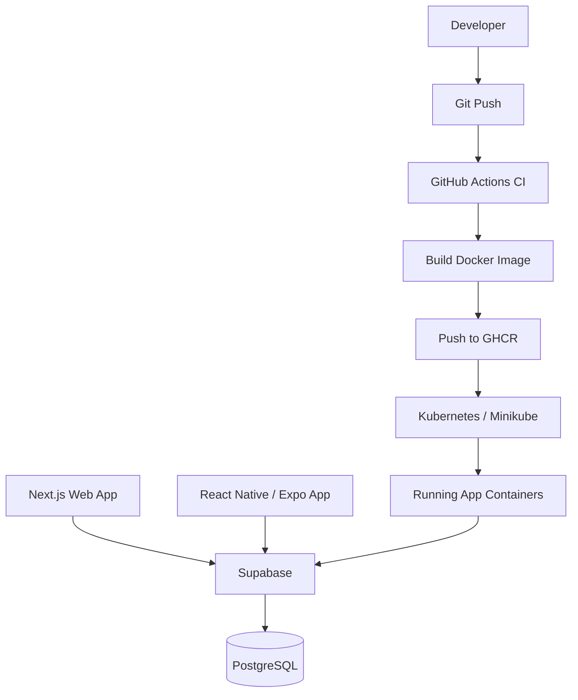

# Rest Assured

A full-stack **health & fitness logging platform** built with **Next.js, React Native, Supabase, Docker, and Kubernetes**.

The project includes a **web application, mobile application, CI pipeline, containerized infrastructure, and Kubernetes deployment**, demonstrating a complete modern development and DevOps workflow.

---

# Features

## Workout Tracking
- create exercises
- organize training splits
- log workouts
- view training history

## User Accounts
- Supabase authentication
- profile management
- secure user data

## Cross Platform
- Web application (Next.js)
- Mobile application (React Native + Expo)

---

## Tech Stack

Rest Assured is built as a full-stack fitness app with a web interface, mobile app, Supabase backend, and a simple DevOps workflow.

| Area | Tools |
|---|---|
| **Web** | [](https://nextjs.org/) [](https://react.dev/) [](https://tailwindcss.com/) |
| **Mobile** | [](https://reactnative.dev/) [](https://expo.dev/) |
| **Backend** | [](https://supabase.com/) [](https://www.postgresql.org/) |
| **DevOps** | [](https://www.docker.com/) [](https://github.com/features/actions) [](https://kubernetes.io/) [](https://minikube.sigs.k8s.io/docs/) |

---

# Architecture


---

# Repository Structure

```
rest-assured
│
├─ web/                     # Next.js web application
│
├─ mobile/                  # React Native mobile app
│
├─ infra/
│   ├─ kubernetes/          # Kubernetes manifests
│   │   ├─ deployment.yml
│   │   ├─ service.yml
│   │   └─ secret.example.yml
│   │
│   └─ scripts/
│       ├─ deploy.sh        # Kubernetes deploy script
│       └─ release.sh       # Full release pipeline
│
├─ docker-compose.yml
│
└─ .github/workflows/       # CI pipelines
```

---

# CI Pipeline

GitHub Actions automatically:

1. installs dependencies  
2. builds the Next.js application  
3. builds the Docker image  
4. pushes the image to **GitHub Container Registry**

Example image:

```
ghcr.io/intscription/gravity-log-web:latest
```

---

# Kubernetes Deployment

The application is deployed using Kubernetes with:

- Deployment
- Service
- Secrets

Example deployment:

```bash
kubectl apply -f infra/kubernetes/
```

---

# Local Deployment

Deploy the latest container image with one command:

```bash
./infra/scripts/release.sh
```

This script:

1. pushes code to GitHub  
2. waits for CI to build the Docker image  
3. deploys the new container to Kubernetes  

---

# Running Locally

## Start the web app

```bash
cd web
npm install
npm run dev
```

---

## Run with Docker

```bash
docker compose up --build
```

---

## Kubernetes Deployment

```bash
minikube start
kubectl apply -f infra/kubernetes/
```

---

# Environment Variables

Create `.env.local` inside `web/`:

```
NEXT_PUBLIC_SUPABASE_URL=
NEXT_PUBLIC_SUPABASE_ANON_KEY=
```

---

# Future Improvements

- Kubernetes Ingress
- Health probes
- GitOps deployment
- Monitoring (Prometheus + Grafana)

---

# Author

Kartik Sanil

---

# Why this project exists

This project demonstrates:

- full-stack application development  
- containerization with Docker  
- CI/CD automation  
- Kubernetes deployment  

It serves as both a **fitness tool and a DevOps learning platform**.
